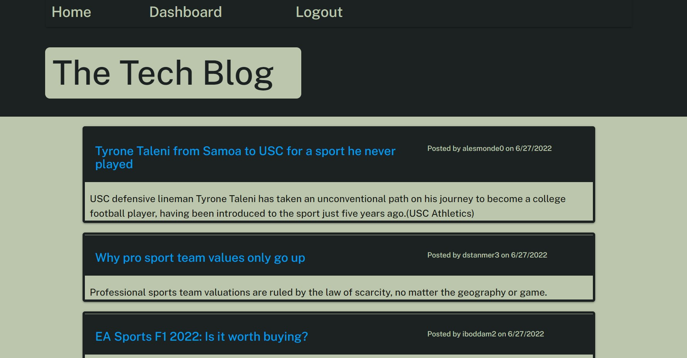

# The-Tech-Blog

## Description

- This application is a CMS-style blog site similar to Wordpress site, where developers can publish their blog posts and comment on other developers' posts.
- Users should create their own account to publish their blog posts, edit and even delete their entire post from the page.
- This application will also allow users to comment on other's posts on the home page.
- This app follows the MVC paradigm in its architectural structure. It also uses express-handlebars package as the templating engine for views, sequlelize and MYSQL2 packages for connecting to database and our Models, Express.js API for our Controllers, and express-sessions npm package for authentication.

## Installation

- You can clone the repo while navigating to the root folder from the command line install the following:

Run Test;
npm run test

Seed DB;
npm run seed

Start Server;
npm start

## Deployed URL

## Github Repository URL

https://github.com/GhulamZaka/the-tech-blog

## Screenshots

